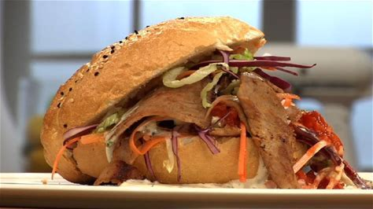

# Lekkere doner kebab
-	Kalfsvlees Van De Platte Bil
- ½	Ui
- 500 milliliters	Melk
- 1	Scheutje Azijn
- 4	Turkse Pitabroodjes
- ½	Wortel
- ¼	Rode Kool
- ½	Krop Ijsbergsla
- 1	Teentjes Knoflook
- 3	Takjes Peterselie
- 2	El Mayonaise
- 2	El Yoghurt
- 2	Tomaten
- 1	El Sambal
- 4	El Tomatenketchup

